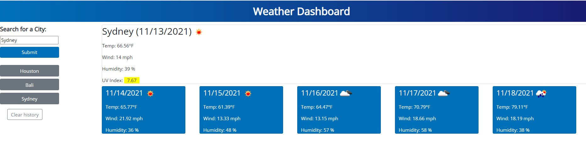

# Challenge 6 - Weather App

## Objective

* Create a weather dashboard that can pull weather from multiple cities

### Critiera

* When a city is searched, the current and future forecasts are presented
* Previously searched cities are maintained in the search history
* City name, date, weather icon, temperature, humidity, wind speed and the UV index are shown under the current weather
* UV index is color coded based on conditions
* Date, weather icon, temperature, wind speed and humidity are displayed under the 5-day weather forecast
* When a city is selected from the search history, the current and forecasted weather conditions are presented

#### Languages / Libraries / APIs Used

* HTML
* CSS
* Javascript
* JQuery
* Bootstrap
* Google fonts
* OpenWeather APIs

#### Links
:star: [Deployed Website](https://rpb543.github.io/awesome-weather-app/)\
:boom: [Link to Repo](https://github.com/RPB543/awesome-weather-app)\
:dizzy: [GitHub](https://github.com/RPB543)

#### Screenshot

